# BugScrub Architecture

BugScrub keeps repo-defined exploratory intent separate from agent-specific runtime details.

## End-to-End Flow

```mermaid
flowchart LR
  A["setup"] --> B["shell rc points bugscrub to dist/bugscrub"]
  B --> C["init"]
  C --> D["detect project + tests"]
  D --> E["write minimal .bugscrub scaffold"]
  E --> F["authoring agent works in isolated workspace"]
  F --> G["validate authored files in isolated workspace"]
  G --> H{"valid?"}
  H -- "no" --> I["feed validation errors back to authoring agent"]
  I --> F
  H -- "yes" --> J["sync validated .bugscrub back to repo"]
  J --> K["discover"]
  K --> L["scan repo + existing .bugscrub files"]
  L --> M["author missing surfaces/workflows only"]
  M --> N["validate authored result before sync"]
  N --> O["generate"]
  O --> P["read one source of truth"]
  P --> Q["draft workflow YAML"]
  Q --> R["run"]
  R --> S["load config + workflow + surfaces"]
  S --> T["resolve refs + validate semantic requirements"]
  T --> U["negotiate adapter capabilities"]
  U --> V["build prompt once"]
  V --> W["AgentAdapter run"]
  W --> X["reports + artifacts"]
```

## Core Boundaries

- Repo state lives under `.bugscrub/`. That is the product surface.
- `init` and `discover` are authoring/bootstrap flows. They should not own workflow execution semantics.
- `init` and `discover` validate authored files before syncing them back to the repo, and `init` can retry authoring with validation feedback when the isolated result is invalid.
- `generate` creates deterministic draft YAML from local evidence like routes, tests, diffs, or an existing workflow.
- `run` is the only place that resolves a workflow into a full `RunContext` and invokes an `AgentAdapter`.
- `init` seeds `local.baseUrl` from framework defaults so each repo starts with an inferred local target that can be refined in config.
- `run` uses the configured target URL directly rather than trying to outsmart the local dev environment at the CLI layer.
- `validate` is the semantic gate for repo-local definitions. It enforces both file-shape/schema correctness and cross-file constraints such as valid workflow requirements.
- Agent adapters are replaceable runtimes. They receive a prepared `RunContext` and return an `AdapterRunOutput`.

## Why The Layers Matter

- `schemas/` protects contracts and keeps repo files strict.
- `core/` loads and resolves repo-local definitions without knowing anything about a specific agent runtime.
- `runner/` owns execution semantics: requirement normalization, capability negotiation, prompt construction, diagnostics, and reports.
- `init/` owns repository bootstrap and authoring agent orchestration.
- `generate/` owns draft inference and output writing.

If a change needs to touch both `generate/` and `runner/`, that is usually a sign the responsibility split should be revisited first.
