# BugScrub Architecture

BugScrub keeps repo-defined exploratory intent separate from agent-specific runtime details.

## End-to-End Flow

```mermaid
flowchart LR
  A["setup"] --> B["shell rc points bugscrub to dist/bugscrub"]
  B --> C["setup-runtime"]
  C --> D["build BugScrub agent image"]
  D --> E["init"]
  E --> F["detect project + tests"]
  F --> G["write minimal .bugscrub scaffold"]
  G --> H["copy repo into disposable workspace"]
  H --> I["authoring agent runs inside Docker"]
  I --> J["validate authored files in disposable workspace"]
  J --> K{"valid?"}
  K -- "no" --> L["feed validation errors back to authoring agent"]
  L --> I
  K -- "yes" --> M["sync validated .bugscrub back to repo"]
  M --> N["discover"]
  N --> O["scan repo + existing .bugscrub files"]
  O --> P["author missing surfaces/workflows only in Docker"]
  P --> Q["validate authored result before sync"]
  Q --> R["generate"]
  R --> S["read one source of truth"]
  S --> T["draft workflow YAML"]
  T --> U["run"]
  U --> V["load config + workflow + surfaces"]
  V --> W["resolve refs + validate semantic requirements"]
  W --> X["negotiate adapter capabilities"]
  X --> Y["copy repo into disposable workspace"]
  Y --> Z["build prompt once"]
  Z --> AA["agent, browser, and dev server run in Docker"]
  AA --> AB["sync .bugscrub artifacts + reports back to host"]
```

## Core Boundaries

- Repo state lives under `.bugscrub/`. That is the product surface.
- Agent-invoking commands do not mutate the host repo directly. They operate on a disposable workspace copy inside Docker and only sync `.bugscrub/**` back to the host.
- The Docker runtime mounts the currently running BugScrub package installation into the container and executes that installation's `dist/bugscrub`, so local checkouts and global installs share the same execution path.
- `init` and `discover` are authoring/bootstrap flows. They should not own workflow execution semantics.
- `init` and `discover` validate authored files before syncing them back to the repo, and `init` can retry authoring with validation feedback when the isolated result is invalid.
- `generate` creates deterministic draft YAML from local evidence like routes, tests, diffs, or an existing workflow.
- `run` is the only place that resolves a workflow into a full `RunContext` and invokes an `AgentAdapter`.
- `init` seeds `local.baseUrl` from framework defaults so each repo starts with an inferred local target that can be refined in config.
- `run` uses the configured target URL directly rather than trying to outsmart the local dev environment at the CLI layer.
- `validate` is the semantic gate for repo-local definitions. It enforces both file-shape/schema correctness and cross-file constraints such as valid workflow requirements.
- Agent adapters are replaceable runtimes. They receive a prepared `RunContext` and return an `AdapterRunOutput`.
- Docker is the required runtime boundary for agent-backed commands in v1.
- Docker Buildx is part of that runtime prerequisite because BugScrub builds its local agent image through `docker buildx build --load`.
- Container auth is agent-specific. BugScrub forwards env-based auth first and falls back to copying the agent CLI login/config into a writable disposable container home only when env auth is absent.

## Why The Layers Matter

- `schemas/` protects contracts and keeps repo files strict.
- `core/` loads and resolves repo-local definitions without knowing anything about a specific agent runtime.
- `runner/` owns execution semantics: requirement normalization, capability negotiation, prompt construction, diagnostics, and reports.
- `init/` owns repository bootstrap and authoring agent orchestration.
- `generate/` owns draft inference and output writing.

If a change needs to touch both `generate/` and `runner/`, that is usually a sign the responsibility split should be revisited first.
